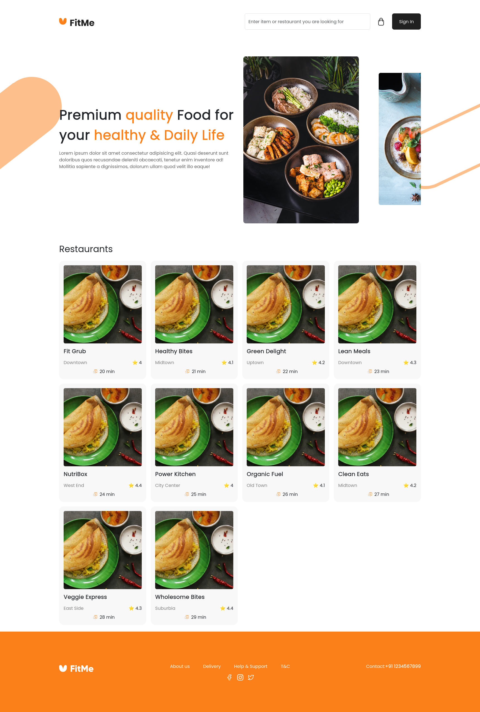

# FitMe

A modern food ordering and restaurant browsing application built with React, TypeScript, and Vite.

## Screenshot



> Add your application screenshot in the root directory as `screenshot.png`

## Features

- Browse restaurants and food items
- User authentication (login/signup)
- Responsive design with custom SCSS styling
- Fast development with Vite HMR

## Tech Stack

- **React** with TypeScript
- **Vite** for build tooling
- **SCSS** for styling
- **React Router** for navigation

## Getting Started

```bash
# Install dependencies
npm install

# Run development server
npm run dev

# Build for production
npm run build
```
